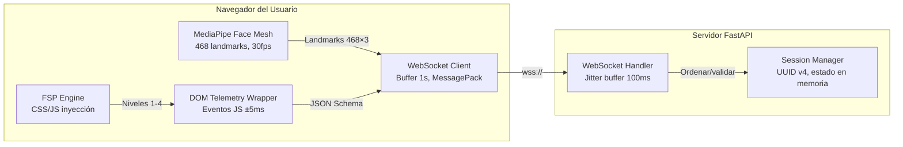
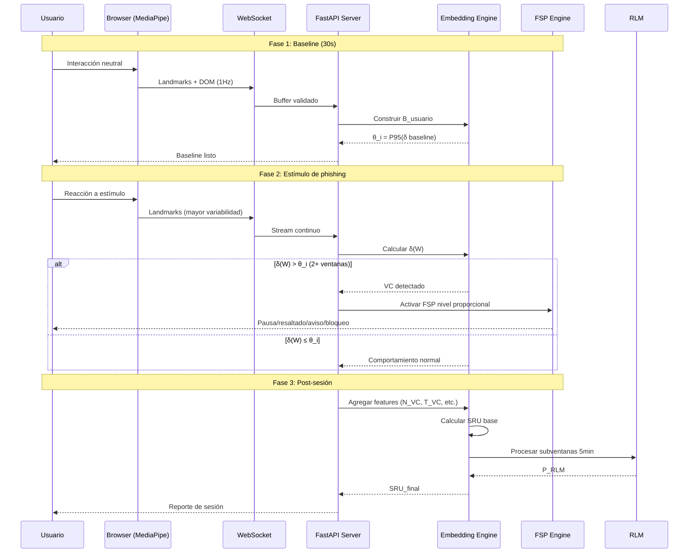

# TSBL — Documento de Arquitectura

> **Versión:** 1.0 (Sprint 0)  
> **Fecha:** 2026-05-23  
> **Autores:** Camilo Yanten Santacruz, Nicolle Tatiana Quijano Jacome

---

## 1. Vista General de Arquitectura (C4 — Nivel 1: Contexto)

```mermaid
graph TB
    subgraph Usuario[" Usuario Fintech"]
        U[Cliente Web con Webcam]
    end

    subgraph TSBL[" TSBL Framework"]
        C[Capa 1: Captura Multimodal]
        E[Capa 2: Embeddings Predictivos]
        A[Capa 3: Análisis Longitudinal]
        F[Capa 4: Fricción de Seguridad]
    end

    subgraph Infraestructura["☁️ Infraestructura"]
        COL[Google Colab T4<br/>Entrenamiento ML]
        DB[(SQLite/PostgreSQL<br/>Datos de sesión)]
        RLM_API[API Externa RLM<br/>OpenAI/Anthropic]
    end

    U -->|Landmarks + DOM events| C
    C -->|Stream WebSocket| E
    E -->|δ(W), episodios VC| F
    E -->|Embeddings + features| A
    A -->|SRU final| DB
    A -.->|Análisis recursivo| RLM_API
    COL -.->|Pesos entrenados| E
```

---

## 2. Diagrama de Componentes (C4 — Nivel 3)

### 2.1. Capa 1 — Captura Multimodal



### 2.2. Capa 2 — Motor de Embeddings

```mermaid
graph LR
    subgraph Preprocessing["Preprocesamiento"]
        RDL[RDL Renderer<br/>Landmarks → (3,16,256,256)]
    end

    subgraph ML["Pipeline ML"]
        XENC[X-Encoder V-JEPA 2<br/>ViT-L/16, pesos congelados<br/>Salida: 1024-dim]
        PJC[Predictor JEPA Compacto<br/>8 capas, 38M params<br/>Salida: 1024-dim]
        DIV[Divergencia δ(W)<br/>1 - cosine_similarity]
        VC[Detector VC<br/>θ calibrado, ≥2 ventanas]
    end

    RDL -->|Tensores video| XENC
    XENC -->|Embeddings contextuales| PJC
    PJC -->|Ŝ_y predicho| DIV
    XENC -->|S_y observado| DIV
    DIV -->|δ(W)| VC
```

### 2.3. Capa 3 — Análisis y SRU

```mermaid
graph TB
    subgraph Features["Features de Sesión"]
        NVC[N_VC: número episodios]
        TVC[T_VC: duración promedio]
        DMAX[δ_max: mayor divergencia]
        ROT[ROT: ratio revisión riesgo]
        CTX[C_ctx: contexto ordinal]
    end

    subgraph Modelo["🤖 Modelo SRU"]
        LR[Regresión Logística<br/>L2 regularizada]
        SHAP[SHAP Values<br/>Interpretabilidad]
    end

    subgraph PostHoc["🔮 Análisis Longitudinal"]
        SEG[Segmentación 5min]
        RLM[RLM Processor<br/>Prompts recursivos]
        PRLM[P_RLM ∈ [0,1]]
    end

    NVC & TVC & DMAX & ROT & CTX --> LR
    LR -->|f(x)| SRU[SRU = 100×(1-f(x))]
    SEG -->|Resúmenes| RLM
    RLM --> PRLM
    PRLM -->|±15 puntos| SRU
    SRU --> SHAP
```

---

## 3. Diagrama de Secuencia — Detección de VC y Activación FSP



---

## 4. Decisiones de Arquitectura (ADRs)

### ADR-001: MediaPipe en el Edge (no servidor)
**Estado:** Aceptado  
**Contexto:** GDPR Art. 9 categoriza biometría como dato especial. Transmisión de imágenes faciales crudas violaría principio de minimización.  
**Decisión:** MediaPipe Face Mesh ejecuta 100% en navegador (WebAssembly). Servidor recibe solo arrays numéricos 468×3.  
**Consecuencias:** (+) Cumplimiento regulatorio, latencia reducida. (-) Dependencia de compatibilidad de navegador, no control sobre calidad de cámara.

### ADR-002: V-JEPA 2 con pesos congelados + Predictor ligero
**Estado:** Aceptado  
**Contexto:** GPU A100/H100 no disponible para proyecto de grado. Fine-tuning completo de V-JEPA 2 requiere > 100 horas GPU.  
**Decisión:** X-Encoder congelado (inferencia en T4). Solo entrenar Predictor JEPA Compacto (38M params) con dataset propio.  
**Consecuencias:** (+) Viabilidad económica, reproducibilidad. (-) Capacidad limitada de adaptación a dominio facial específico (mitigado con RDL).

### ADR-003: SQLite para desarrollo, PostgreSQL para producción
**Estado:** Aceptado  
**Contexto:** Proyecto de grado no requiere alta concurrencia en fase de investigación.  
**Decisión:** SQLite en desarrollo (cero configuración). Migración a PostgreSQL via SQLAlchemy/Alembic si se escala.  
**Consecuencias:** (+) Simplicidad, portabilidad. (-) No apto para concurrencia alta en producción.

### ADR-004: Holm-Bonferroni sobre Bonferroni clásico
**Estado:** Aceptado  
**Contexto:** 4 hipótesis primarias con correlación esperada entre H1 y H4 (misma señal de entrada).  
**Decisión:** Holm-Bonferroni secuencial mantiene FWER ≤ 0.05 con mayor poder estadístico.  
**Consecuencias:** (+) Mayor poder, no requiere independencia. (-) Ligeramente más complejo de implementar/reportar.

---

## 5. Stack Tecnológico Detallado

| Capa | Tecnología | Versión | Rol |
|:---|:---|:---:|:---|
| Frontend | Vanilla JS + MediaPipe | 0.10.11 | Captura, FSP, demo |
| Backend | FastAPI + Uvicorn | 0.111.0 | API REST, WebSocket |
| ML | PyTorch + TorchVision | 2.3.0 | Embeddings, predictor |
| Datos | SQLAlchemy + Alembic | 2.0.30 | ORM, migraciones |
| Testing | pytest + Jest | 8.2.0 / 29.7.0 | Unit + integration |
| CI/CD | GitHub Actions | — | Lint, test, security |
| Colab | Google Colab T4 | — | Entrenamiento PJC |
| Docs | Markdown + Mermaid | — | Arquitectura, tesis |

---

## 6. Roadmap de Evolución Arquitectónica

| Sprint | Cambio Arquitectónico | Justificación |
|:---:|:---|:---|
| 1 | MediaPipe real en browser | Reemplazar placeholder de landmarks |
| 2 | Integrar X-Encoder V-JEPA 2 | Cargar pesos preentrenados en Colab |
| 3 | Entrenar PJC + calibrar θ | Dataset piloto (n=16) |
| 4 | Integrar RLM vía API | Análisis post-sesión con LLM |
| 5 | Docker Compose para staging | Preparar demo para jurados |

---

*Documento mantenido en `docs/ARCHITECTURE.md` — actualizar en cada Sprint Review*
